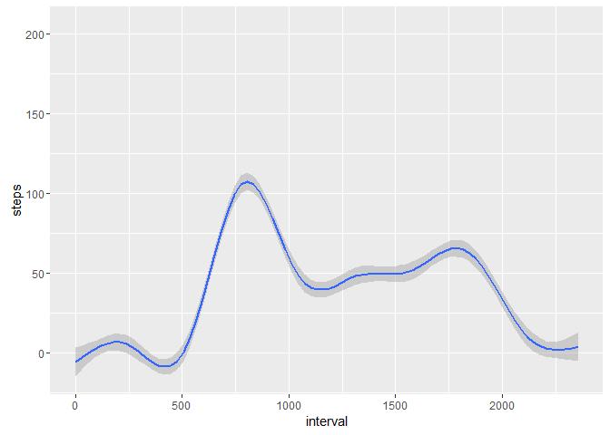

# Reproducible Research: Peer Assessment 1


## Loading and preprocessing the data
This is the Programming Assignment for Week 2 of the Reproducible Research
section of the Johns Hopkins University specialization in data science. For this
project, we are looking data from fitness trackers. The code chunk below 
downloads, unzips, and reads in our data.


```r
download.file("https://d396qusza40orc.cloudfront.net/repdata%2Fdata%2Factivity.zip", 
    destfile = "activity.zip")
unzip("activity.zip")
activity <- read.csv("activity.csv", na.strings = "NA")
```


## What is mean total number of steps taken per day?
The below code creates a histogram of the total steps taken in a day 
by the subject.

```r
daily.steps <- tapply(activity$steps,activity$date,sum)
hist(daily.steps, breaks = 20, col = 'blue', main = 'Histogram of Daily Step Total',
     xlab = 'Steps')
```

<!-- -->

We are also interested in the **mean** and **median** for our subject's total steps
per day. The code below shows that those are 10,766.19 and 10,765, respectively. 


```r
mean(daily.steps, na.rm = T)
```

```
## [1] 10766.19
```

```r
median(daily.steps, na.rm = T)
```

```
## [1] 10765
```


## What is the average daily activity pattern?
The plot below shows the average step count at each five-minute interval for the 
duration of the study. 

```r
library(ggplot2)
ggplot(data = activity[!is.na(activity$steps), ], aes(x = interval, y = steps)) + 
    geom_smooth() + stat_summary(fun.y = mean, na.rm = TRUE)
```

<!-- -->

We can see here that the interval with the highest daily average is 
between 835 and 840, which corresponds to 13:55 and 14:00. The subject averaged 
just over 206 steps in this interval. 

```r
interval.trend <- tapply(activity$steps, activity$interval, mean, na.rm = TRUE)
max.avg <- max(interval.trend)
interval.trend[interval.trend == max.avg]
```

```
##      835 
## 206.1698
```


## Imputing missing values
Since there are some time periods with null values, we need to deal with them
in a way that makes sense. First, let's see how many rows have null values for 
the `steps` variable.

```r
sum(is.na(activity$steps))
```

```
## [1] 2304
```
It appears that 2304 observations have a null value for `steps`.
To handle this, we will impute the median number of steps for 
that five-minute interval and save the modified data frame as `imputed`.

```r
imputed <- activity
imputed$steps[is.na(imputed$steps)] <- with(imputed, 
                                           ave(steps, interval, 
                                           FUN = function(x) 
                                           median(x, na.rm = 
                                                  TRUE)))[is.na(imputed$steps)]
```

The histogram below shows the same histogram as above, but with the 
missing values imputed. We can see that there is a *much* larger concentration
at a step count of 0, meaning that the majority of missing values occurred in
intervals which did not see a high volume of steps. 

```r
imputed.steps <- tapply(imputed$steps,imputed$date,sum)
hist(imputed.steps, breaks = 20, col = 'blue', 
     main = 'Histogram of Daily Step Total - With Missing Values Replaced',
     xlab = 'Steps')
```

<!-- -->

The mean and median of the modified totals are now 9,503.869 and 10,395. The 
high volume of zeros imputed has shifted our daily totals down by quite a bit --- 
this is due to the fact that null values are no longer ignored.

```r
mean(imputed.steps)
```

```
## [1] 9503.869
```

```r
median(imputed.steps)
```

```
## [1] 10395
```


## Are there differences in activity patterns between weekdays and weekends?
We'll start by creating the factor variable to signify weekdays versus weekends.

```r
imputed$weekday <- ifelse(weekdays(as.Date(imputed$date)) %in% c('Saturday','Sunday'),
                          'weekend',
                          'weekday')
```

Next, we will split our data by weekend and weekday, giving the average number 
of steps taken during each interval for the days in the given category. We can 
see that the subject took the majority of his/her steps later in the day on 
the weekends, whereas the majority of weekday steps occur in the first few waking
hours.


```r
library(grid)
library(gridExtra)
```

```
## Warning: package 'gridExtra' was built under R version 3.3.3
```

```r
plot_1 <- ggplot(data = imputed[imputed$weekday == "weekday", ], aes(x = interval, 
    y = steps)) + theme_bw() + stat_summary(fun.y = mean, na.rm = T) + geom_smooth() + 
    labs(x = "5-minute Interval", y = "Steps", title = "Weekday")

plot_2 <- ggplot(data = imputed[imputed$weekday != "weekday", ], aes(x = interval, 
    y = steps)) + theme_bw() + stat_summary(fun.y = mean, na.rm = T) + geom_smooth() + 
    labs(x = "5-minute Interval", y = "Steps", title = "Weekend")

grid.arrange(plot_1, plot_2, nrow = 2)
```

<!-- -->
